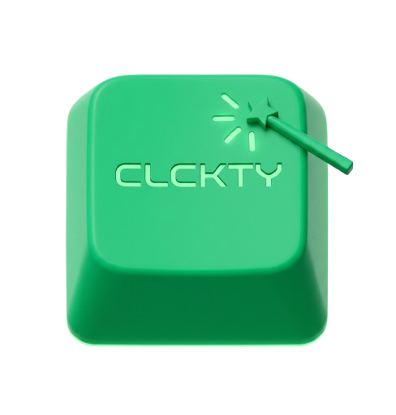

<div align="center">
  
  <h1>CLCKTY</h1>
  <p><strong>A Minimalist, Low-Latency Keyboard & Mouse Sound Emulator</strong></p>

  <p>
    
    
    
    
  </p>

  <hr />

  <h3>🚀 Instant Access</h3>
  <p>Experience mechanical clicks on any keyboard instantly:</p>
  <a href="https://github.com/GlytheHorizon/CLCKTY/releases/tag/v2.1.1" style="text-decoration:none;">
    
  </a>
  <p><small>Portable One-File Release for Windows</small></p>

  <hr />
</div>

## 🎹 About the Project

> [!IMPORTANT]
> **CLCKTY** is a dedicated Windows utility designed to bring the tactile auditory experience of mechanical keyboards and premium mouse clicks to any setup. Built with a focus on performance, it ensures near-zero latency playback for a seamless typing experience.

---

## ✨ Key Features

| Feature | Description |
| :--- | :--- |
| **Global Capture** | Hooks into system-wide keyboard and mouse events without logging a single keystroke. |
| **Low-Latency Audio** | Powered by NAudio for high-performance, real-time sound triggering. |
| **Custom Mappings** | Map specific keys or mouse buttons to unique audio samples. |
| **Soundpack Support** | Import custom packs and manage separate profiles for different setups. |
| **Tray Integration** | Runs discreetly in the system tray with quick toggles and volume control. |
| **Auto-Updater** | Built-in GitHub release scanner to keep your app up to date automatically. |

---

## 🛠️ Built With

<div align="center">
  <table>
    <tr>
      <td align="center" width="96">
        
        <br />.NET 8
      </td>
      <td align="center" width="96">
        
        <br />C#
      </td>
      <td align="center" width="96">
        
        <br />VS 2022
      </td>
      <td align="center" width="96">
        
        <br />GitHub
      </td>
    </tr>
  </table>
</div>

---

## 🏗️ Developer Setup

### Prerequisites
- **Visual Studio 2022** (with .NET desktop development workload)
- **.NET 8 SDK**

### Installation
```powershell
# 1. Clone the repository
git clone https://github.com/GlytheHorizon/CLCKTY.git

# 2. Enter directory
cd CLCKTY

# 3. Restore and Build
dotnet build CLCKTY.slnx -c Release

# 4. Run the Application
dotnet run --project src/CLCKTY.App/CLCKTY.App.csproj
```

---

## 📄 License & Credits

- **License**: Licensed under the [MIT License](LICENSE).
- **Author**: Created with ❤️ by **Jerwin Cruz (GlytheHorizon)**.
- **Inspiration**: Inspired by [Keeby] (https://getkeeby.com/) and [MechVibes](https://mechvibes.com/).

<div align="center">
  <p><i>CLCKTY — Elevating your auditory typing experience, one click at a time.</i></p>
</div>
